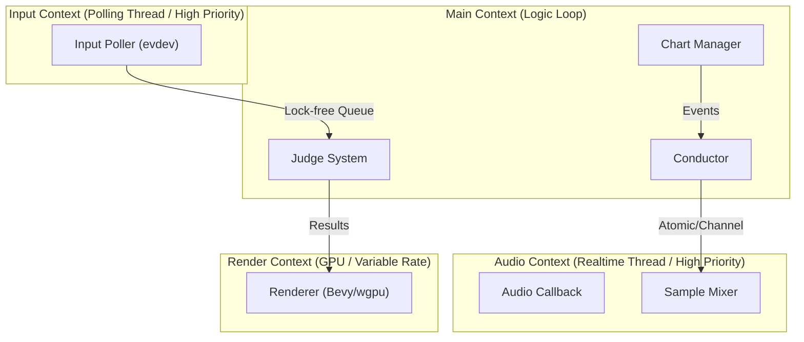

# Oxidizer - Architecture Design Document

## . 設計哲学 (Core Philosophy)

### 1.1 Audio is God (音声絶対主義)

* 原則: ゲーム内の「現在時刻」は、システム時計やフレーム数ではなく、オーディオドライバが実際に消費したサンプル数から逆算される。
* 理由: 映像が遅延したり、GPU性能不足でフレームレートが低下してもゲームとしての同期を保つため。

### 1.2 Input is King (入力優先主義)

* 原則: 入力処理は描画フレームレートに依存しない。独立したスレッドで高頻度（1000Hz以上）にポーリングされ、正確なタイムスタンプと共にキューイングされる。

### 1.3 Lightweight by Design (軽量設計)

* 原則: DDR3メモリやiGPU（Intel HD 4600 / Vega 8）環境でも144Hz動作を保証するため、不要なアロケーションとGPUへのバス転送を極限まで削減する。

## 2. システム階層構造 (System Hierarchy)

* Rustの所有権モデルに基づき、4つの独立したコンテキスト（スレッド）に分離する。

## 3. コンポーネント詳細

### 3.1 Audio System

* 役割: マスタクロックの提供、SE/BGMのミキシング、タイムストレッチ。
* 技術: cpal (Backend: PipeWire/ALSA), rubato (Resampling).

* データ構造: メモリ効率を重視し、Arc<Vec<f32>> で波形データを共有。デコード済みデータをキャッシュするが、ストリーミング再生（ディスク読み込み）は行わず、プレイ開始前にRAMへロードする方針（DDR3環境でのI/O遅延回避のため）。
* 同期: メインスレッドとは Arc<AtomicU64> で同期。

### 3.2 Conductor (Timekeeper)

* 役割: Audio Systemの進捗を監視し、ゲームロジック用時刻 f64 (秒) を提供。
* ジッター対策: 低スペックCPUでのスレッド切り替え遅延を考慮し、単純な線形補間ではなく、移動平均等を用いたスムージングを行う。

### 3.3 Input System

* 役割: デバイス入力を生で取得。
* 技術: evdev (Linux) / gilrs。
* 最適化: ポーリングスレッドは SCHED_FIFO を適用し、CPU負荷が高まった際も入力を取りこぼさないようにする。

### 3.4 Logic & Chart

* 役割: 譜面の管理、判定、生成。
* 生成: 無限モードの生成ロジックは計算負荷が低いため、メインループ内で行う。

### 3.5 Renderer (iGPU Optimization)

* 技術: Bevy (wgpu)。
* 戦略:
  * Batching: ドローコールを削減するため、ノーツや判定文字は可能な限りスプライトバッチングを行う。
  * No Post-Processing: 重いポストプロセス（Bloom等）は避け、テクスチャベースのエフェクトを使用する。
  * Present Mode: Mailbox (Fast VSync) を推奨するが、GPU負荷が高い場合は Immediate (VSync Off) を許容するオプションを設ける。

## 4. Linux特化最適化戦略

* Audio/Input: Realtime 優先度 (SCHED_FIFO) の適用。
* Compositor: KWin (KDE) 等のコンポジタに対し、起動時に _NET_WM_BYPASS_COMPOSITOR ヒントを送信し、低遅延描画モードを強制する。

## 5. レガシーハードウェア適応 (Legacy Hardware Adaptation)

* SIMD: AVX2 (Haswell以降) を有効化するが、AVX-512は必須としない。
* Memory: アセットロード時のメモリ使用量を監視し、4GB環境下でもスワップが発生しないよう管理する。